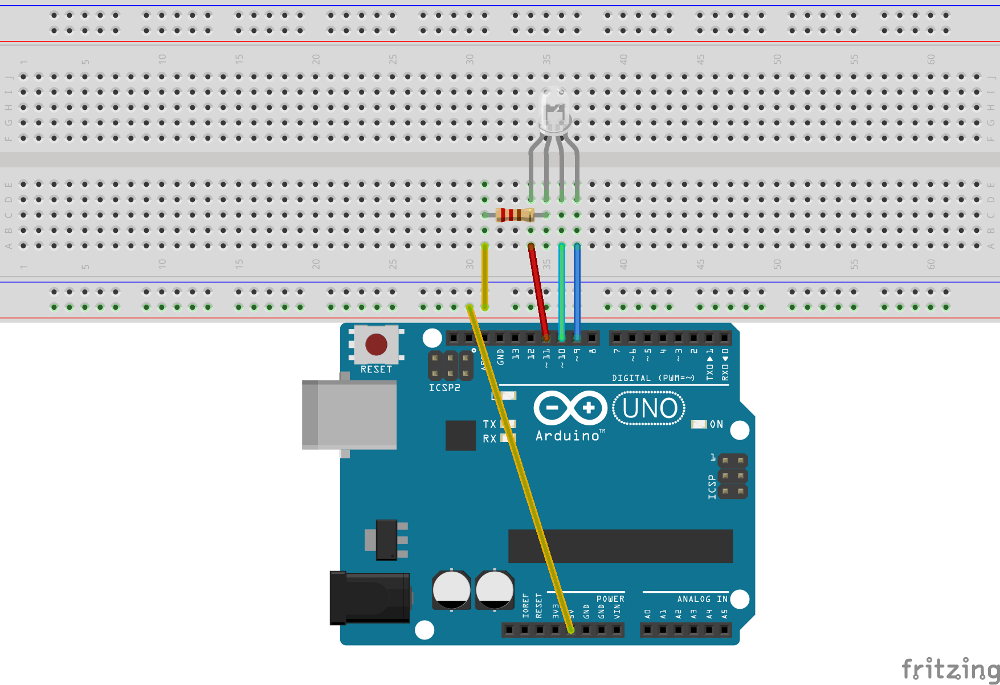

#PI2Arduino
This project is at its early stages of development. Many tutorials are already out there to get the Raspberry Pi and Arduino to communicate. My goal is to create a heavily commented structure of what is needed. I went with using Node.js because I wanted to make the Arduino respond to Twitter. That was my first though, but now that I have looking into it it seems that there is more potential then just Twitter.

##Shout Outs
http://www.barryvandam.com/node-js-communicating-with-arduino
Without Barry Van Dam files, this would have taken me a whole lot longer. Take a look at his settup. It is a little more complex than this but only due to the fact that I am not have the Arduino talk to the Raspberry Pi right now (I don't see the need yet).

http://blog.dahlke.us/setting-up-a-raspberry-pi-web-server-using-node-express/
This tutorial help me get Node.js installed on the Raspberry Pi (only I insalled the source and complied it). If you do compile it give yourself about 2 or 3 hours till it is done (it was worth it to me).

https://mynook.barnesandnoble.com/productDetail.html?ean=9781471624216
After everything installed I don't like copying and pasting code (if I don't understand it). This book helped me understand a great deal on how Node.js works and how to do some pretty neat things with it.

https://gist.github.com/neildahlke/7330357
This is where I will learn a little bit about the Twitter API and how to use it in Node.js.

##Current Standings
I currently have 4 buttons in an html file that are used to controll the color of my RGB LED(common anode) that is connected to my Arduino.

##Prerequisits
1. Arduino Uno (I am using R3)
2. Raspberry Pi (Model B) that is already booted
3. Node.js, Socket.IO, and serialPort installed on the Raspberry Pi (Will Cover tutorial later)

##Pictures of my setup

